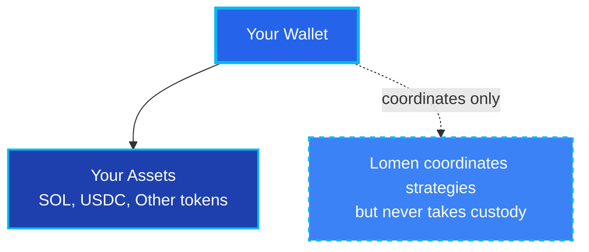

## Self-Custody Model

Lomen is built on a fundamental principle: **you own your assets, always**. Unlike traditional custodial platforms, your assets never leave your wallet. You maintain complete control and can exit any strategy at any time.

## How Self-Custody Works

When you use Lomen:

1. **Your wallet stays yours**: Assets remain in your wallet address
2. **You approve transactions**: Every action requires your explicit approval
3. **No deposits required**: We never hold your assets
4. **Exit anytime**: You can withdraw or change strategies instantly

## Security Guarantees

### Non-Custodial Architecture

- **No custody risk**: We cannot access, freeze, or seize your assets
- **No withdrawal limits**: Your assets are always accessible
- **No counterparty risk**: You're not trusting us with your funds

### Smart Contract Security

While we don't reveal specific implementation details, our security approach includes:

- **Audited protocols**: We work with well-established, audited DeFi protocols
- **Risk assessment**: Our AI evaluates smart contract risks before recommending strategies
- **Transparency**: You can see exactly which protocols your basket uses

### Transaction Security

- **You control approvals**: Every transaction requires your wallet signature
- **Transaction preview**: See exactly what will happen before approving
- **No hidden fees**: All costs are transparent upfront

## Best Practices for Users

### Wallet Security

<CardGroup cols={2}>
  <Card title="Use Hardware Wallets" icon="key">
    For significant amounts, use hardware wallets (Ledger, Trezor) for maximum
    security.
  </Card>
  <Card title="Protect Your Seed Phrase" icon="lock">
    Never share your seed phrase or private keys with anyone, including Lomen
    support.
  </Card>
  <Card title="Verify URLs" icon="globe">
    Always verify you're on the official Lomen app (app.getlomen.com) before
    connecting your wallet.
  </Card>
  <Card title="Review Transactions" icon="eye">
    Carefully review all transaction details before approving, especially
    amounts and recipients.
  </Card>
</CardGroup>

### Strategy Security

- **Start small**: Test with small amounts before committing larger capital
- **Understand risks**: Read strategy details and understand what protocols are involved
- **Monitor regularly**: Check your positions periodically to ensure everything is working as expected
- **Stay informed**: Keep up with protocol updates and market conditions

## Common Security Concerns

### "Can Lomen access my funds?"

**No.** Lomen never has custody of your assets. We only coordinate transactions that you approve. Your wallet and private keys remain entirely under your control.

### "What if Lomen goes offline?"

Your assets remain in your wallet and can be managed directly through the underlying protocols. While Lomen's interface makes management easier, you're not dependent on us for access to your funds.

### "Are the protocols safe?"

We evaluate protocol security as part of our strategy discovery process. However, all DeFi protocols carry smart contract risk. We recommend:

- Only investing what you can afford to lose
- Diversifying across multiple protocols
- Staying informed about protocol security

### "What about smart contract bugs?"

All DeFi protocols carry smart contract risk. We work with established, audited protocols, but no system is 100% risk-free. This is why we emphasize transparency — you can see exactly which protocols your basket uses.

## What Lomen Cannot Do

To be clear about the boundaries:

- ❌ We cannot access your wallet or assets
- ❌ We cannot freeze or seize your funds
- ❌ We cannot reverse transactions
- ❌ We cannot recover lost seed phrases or private keys
- ❌ We cannot guarantee returns or prevent losses

## What You Control

You maintain complete control over:

- ✅ Your wallet and private keys
- ✅ Which baskets to use
- ✅ When to enter or exit strategies
- ✅ Transaction approvals
- ✅ Asset withdrawals

## Reporting Security Issues

If you discover a security issue:

1. **Do not** share details publicly immediately
2. Contact us through official channels
3. Provide details of the issue
4. Allow time for investigation and fixes

For security inquiries, reach out through our [community channels](https://t.me/lomen_ai).

## Remember

Self-custody means **you** are responsible for:

- Securing your wallet and seed phrase
- Approving transactions carefully
- Understanding the risks of DeFi strategies
- Managing your own security practices

Lomen provides the tools and interface to make DeFi accessible, but the security of your assets ultimately depends on your own practices. Stay vigilant, stay informed, and only invest what you can afford to lose.
